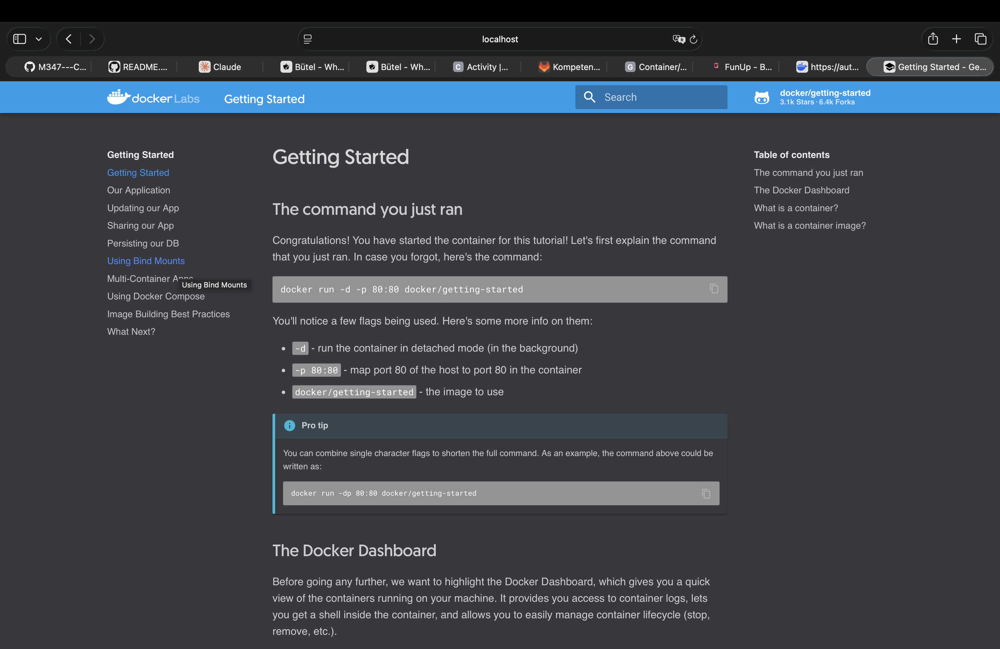
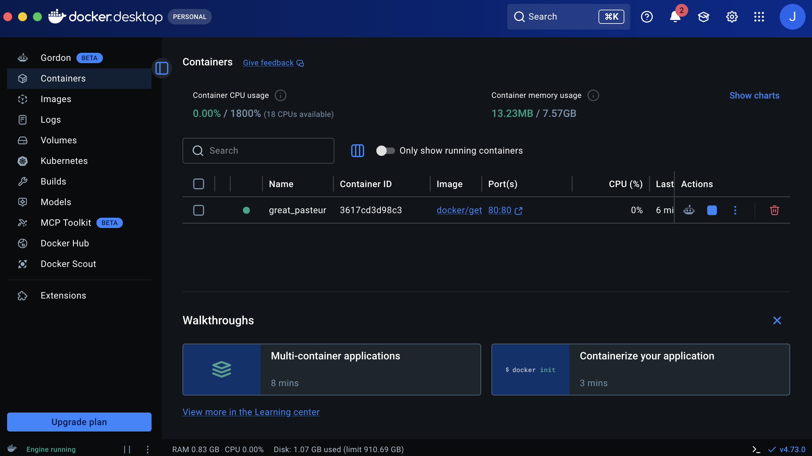
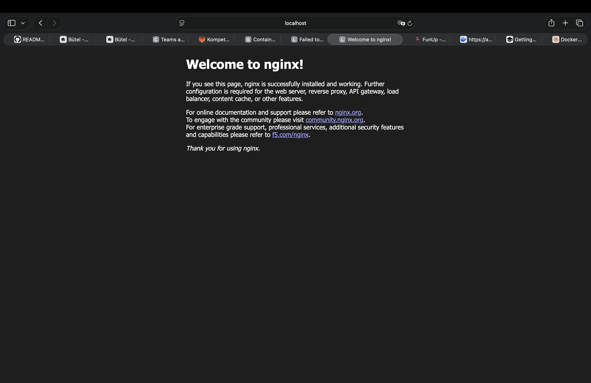
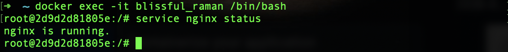
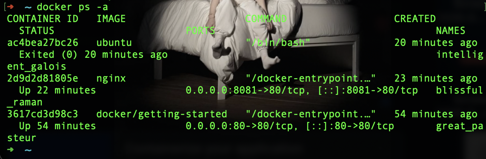
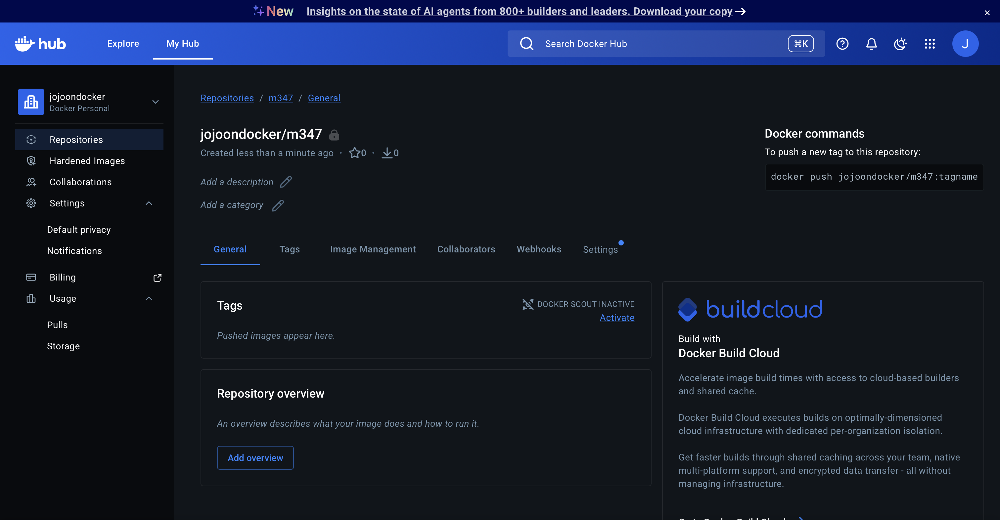
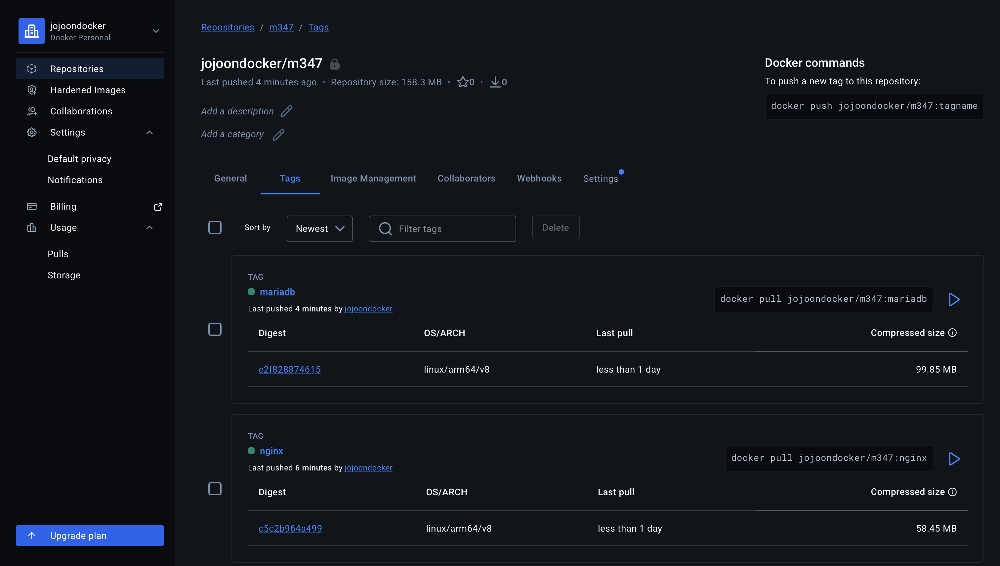

# KN01

## A

**Docker Version abfragen:**
```bash
docker version
```




---

## B

### 3 & 4 — Wichtige Flags



| Flag | Bedeutung |
|------|-----------|
| `docker run -d` | **Detached mode** — startet den Container im Hintergrund, das Terminal bleibt frei |
| `docker run -p` | **Port-Mapping** — mappt einen Host-Port auf einen Container-Port (z.B. `-p 8080:80` → Host `8080` → Container `80`) |

---

### 5 — Befehle erklärt

#### 5.1 — `docker run -d nginx`

`docker run -d` lädt das Image herunter (falls nicht lokal vorhanden) und startet den Container im Hintergrund. Der nginx-Container läuft, ist aber von aussen **nicht erreichbar**, da kein Port mit `-p` gemappt wurde. Um darauf zugreifen zu können, müsste man z.B. `-p 8080:80` anhängen.

#### 5.2 — `docker run -it`

Mit `docker run -it` startet man einen Container im **interaktiven Modus**:

- `-i` (**interactive**) — hält den Standard-Input (stdin) offen
- `-t` (**tty**) — weist dem Container ein Pseudo-Terminal zu

Zusammen ermöglichen sie, direkt mit dem Container zu interagieren, als ob man in einer normalen Shell sitzt (z.B. `root@a3f5c2b1:/#`). Sobald man die Shell mit `exit` verlässt, stoppt der Container.

---

### 6 — Nginx läuft



---

### 7 — Container Status

```bash
docker ps -a
```



---

## C — Docker Hub Repository (leer)



---

## D — Images pullen, taggen und pushen

### Befehle & Erklärung

| Befehl | Bedeutung |
|--------|-----------|
| `docker pull <image>` | Lädt ein Image von Docker Hub herunter |
| `docker tag <image> <repo>:<tag>` | Weist dem lokalen Image einen neuen Namen/Tag zu |
| `docker push <repo>:<tag>` | Pusht das getaggte Image ins Docker Hub Repository |

---

### nginx

```bash
docker pull nginx
docker tag nginx:latest jojoondocker/m347:nginx
docker push jojoondocker/m347:nginx
```

**Output:**
```
latest: Pulling from library/nginx
...
Digest: sha256:1881968aff6f7cdcc4b888c00a11f4ce241ad7ec957e0cb4a9e19e93a3ff87ea
Status: Downloaded newer image for nginx:latest

nginx: digest: sha256:c5c2b964a499822699fdf5e520bf8a3c2cc6434f8caac07a2028d7f3023b9972 size: 2292
```

---

### mariadb

```bash
docker pull mariadb
docker tag mariadb:latest jojoondocker/m347:mariadb
docker push jojoondocker/m347:mariadb
```

**Output:**
```
latest: Pulling from library/mariadb
...
Digest: sha256:e0236fc6386e7eacd9359e59d0a078bd7aa0d18280d36d13061121bedeaee903
Status: Downloaded newer image for mariadb:latest

mariadb: digest: sha256:e2f828874615bf3910d733e1b3b7570c25e6491de74b9270ec29a613c85a030c size: 2480
```

