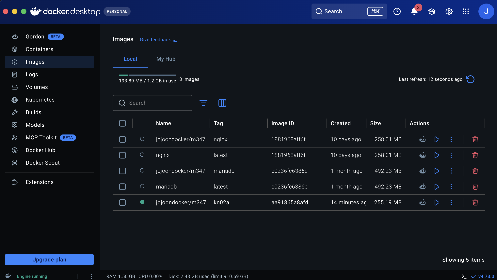
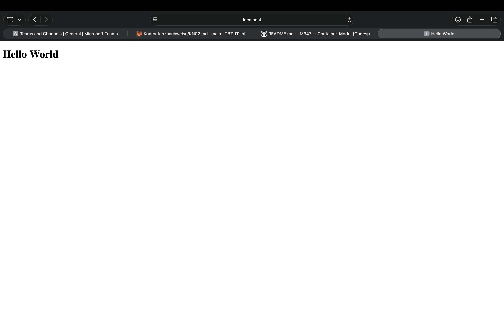
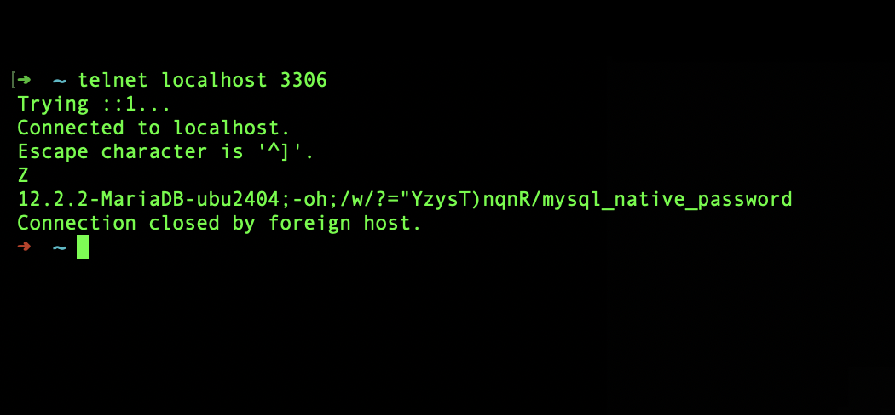
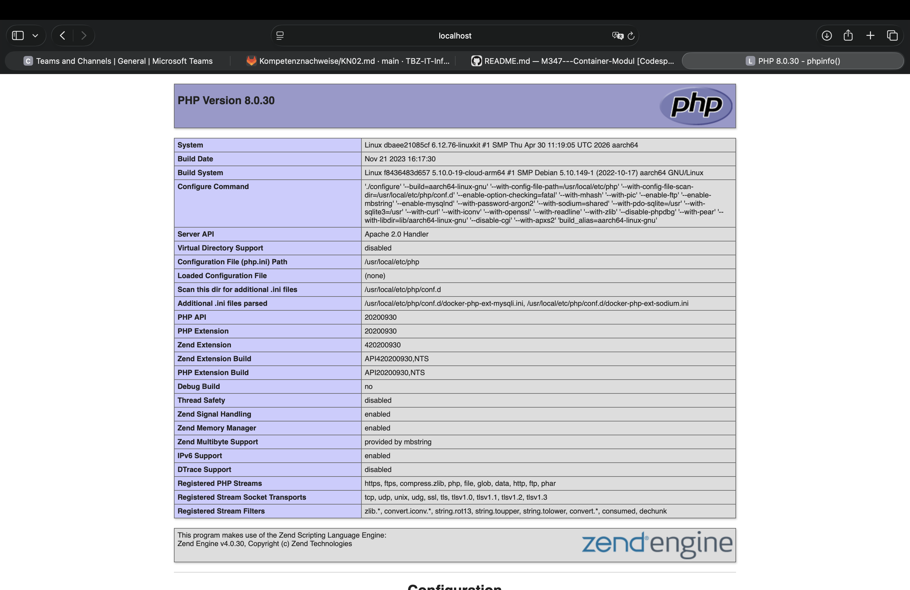
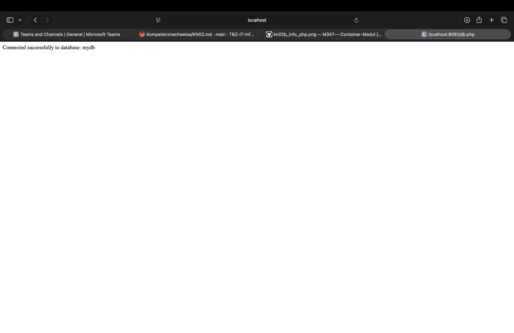

# KN02: Dockerfile

## A) Dockerfile I

### Original Dockerfile – Dokumentiert

```dockerfile
FROM nginx
# Basis-Image. Hier nehmen wir das offizielle nginx-Image von Docker Hub.

COPY static-html-directory /var/www/html
# Kopiert den lokalen Ordner ins Container-Verzeichnis, wo nginx die HTML-Files erwartet.

EXPOSE 80
# Sagt Docker, dass der Container auf Port 80 läuft.
# Öffnet den Port aber noch nicht – das passiert erst mit -p beim docker run.
```

---

### Angepasstes Dockerfile – für helloworld.html

```dockerfile
FROM nginx

WORKDIR /usr/share/nginx/html
# nginx serviert standardmässig aus diesem Verzeichnis (laut Docker Hub Doku).
# Alle COPY-Befehle danach beziehen sich automatisch auf diesen Pfad.

COPY helloworld.html .
# Kopiert helloworld.html ins Arbeitsverzeichnis im Container.

EXPOSE 80
```

---

### Docker-Befehle

```bash
# Image bauen
docker build -t jojoondocker/kn02:kn02a .

# Container starten
docker run -d -p 8080:80 --name kn02a jojoondocker/kn02:kn02a

# Pushen
docker push jojoondocker/kn02:kn02a
```

Erreichbar unter: `http://localhost:8080/helloworld.html`

---

### Screenshots





---

## B) Dockerfile II

### DB-Container (mariadb)

```dockerfile
FROM mariadb

ENV MYSQL_ROOT_PASSWORD=rootpassword
# Root-Passwort direkt im Image gesetzt – kein -e beim docker run nötig.

ENV MYSQL_DATABASE=mydb
# Datenbank wird beim Start automatisch erstellt.

ENV MYSQL_USER=dbuser
ENV MYSQL_PASSWORD=dbpassword

EXPOSE 3306
```

```bash
docker build -t jojoondocker/kn02:kn02b-db .
docker run -d -p 3306:3306 --name kn02b-db jojoondocker/kn02:kn02b-db
docker push jojoondocker/kn02:kn02b-db
```

---

### Screenshot: Telnet – DB-Verbindung



---

### Web-Container (PHP + Apache)

Zuerst die IP des DB-Containers rausfinden:

```bash
docker inspect kn02b-db
```

Den `"IPAddress"`-Wert dann in `db.php` eintragen:

```php
$host = "172.17.0.x";
```

```dockerfile
FROM php:8.0-apache

WORKDIR /var/www/html

COPY info.php .
COPY db.php .
# db.php muss vorher mit der richtigen DB-IP angepasst werden.

RUN docker-php-ext-install mysqli
# mysqli-Extension installieren, sonst kann PHP nicht auf MariaDB zugreifen.

EXPOSE 80
```

```bash
docker build -t jojoondocker/kn02:kn02b-web .
docker run -d -p 8080:80 --name kn02b-web jojoondocker/kn02:kn02b-web
docker push jojoondocker/kn02:kn02b-web
```

---

### Screenshots



