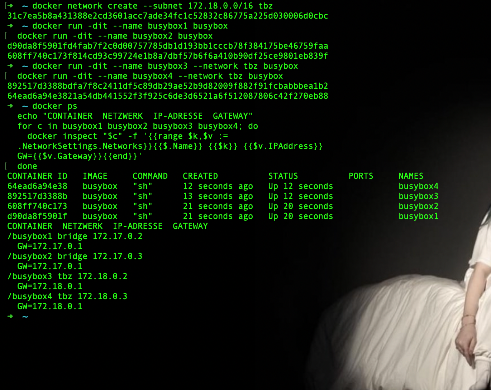
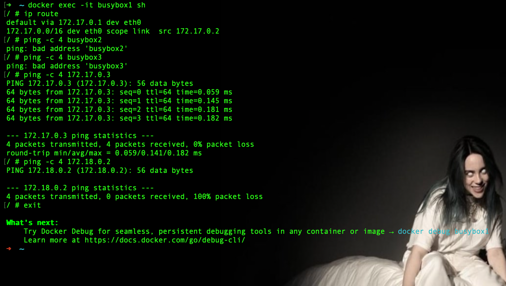
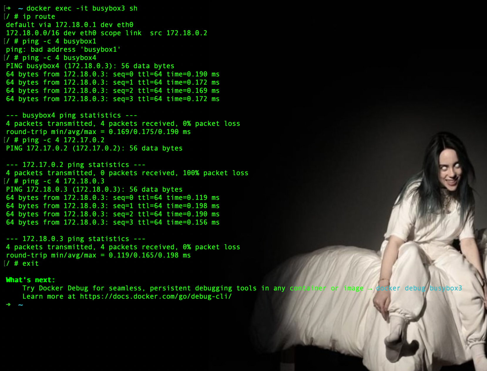
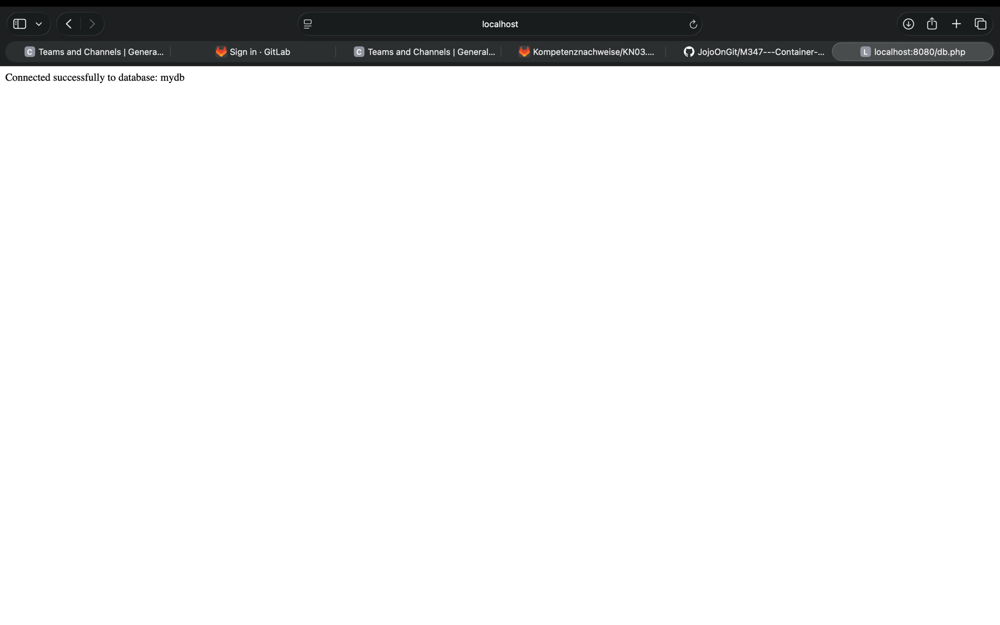

# KN03: Netzwerk, Sicherheit

## A) Eigenes Netzwerk

Zielsystem: vier `busybox`-Container. busybox1 + busybox2 hängen im default `bridge`-Netzwerk, busybox3 + busybox4 in einem user-defined Netzwerk `tbz` mit dem Range `172.18.0.0/16`.

### Aufbau

```bash
docker network create --subnet 172.18.0.0/16 tbz

docker run -dit --name busybox1 busybox
docker run -dit --name busybox2 busybox

docker run -dit --name busybox3 --network tbz busybox
docker run -dit --name busybox4 --network tbz busybox
```

Das default `bridge`-Netzwerk lässt sich nicht ändern und behält seinen Range `172.17.0.0/16`. Mit `-dit` läuft die `sh` der busybox dauerhaft im Hintergrund, damit die Container nicht sofort wieder stoppen.

### IP-Adressen und Gateways

Ermittelt mit `docker ps` und `docker inspect`:

| Container | Netzwerk | IP-Adresse | Gateway |
|-----------|----------|------------|---------|
| busybox1  | bridge   | 172.17.0.2 | 172.17.0.1 |
| busybox2  | bridge   | 172.17.0.3 | 172.17.0.1 |
| busybox3  | tbz      | 172.18.0.2 | 172.18.0.1 |
| busybox4  | tbz      | 172.18.0.3 | 172.18.0.1 |



### Interaktive Session auf busybox1 (default bridge)

```bash
docker exec -it busybox1 sh
```

```sh
ip route
ping -c 4 busybox2
ping -c 4 busybox3
ping -c 4 172.17.0.3
ping -c 4 172.18.0.2
```

| Befehl | Ergebnis |
|--------|----------|
| `ip route` | Default-Gateway `172.17.0.1` (gleich wie busybox2) |
| `ping busybox2` | `bad address` – Name nicht auflösbar |
| `ping busybox3` | `bad address` – Name nicht auflösbar |
| `ping 172.17.0.3` (busybox2) | 0% packet loss – erreichbar |
| `ping 172.18.0.2` (busybox3) | 100% packet loss – nicht erreichbar |



### Interaktive Session auf busybox3 (tbz)

```bash
docker exec -it busybox3 sh
```

```sh
ip route
ping -c 4 busybox1
ping -c 4 busybox4
ping -c 4 172.17.0.2
ping -c 4 172.18.0.3
```

| Befehl | Ergebnis |
|--------|----------|
| `ip route` | Default-Gateway `172.18.0.1` (gleich wie busybox4) |
| `ping busybox1` | `bad address` – Name nicht auflösbar |
| `ping busybox4` | 0% packet loss – per **Name** erreichbar |
| `ping 172.17.0.2` (busybox1) | 100% packet loss – nicht erreichbar |
| `ping 172.18.0.3` (busybox4) | 0% packet loss – erreichbar |



### Gemeinsamkeiten und Unterschiede

**Gemeinsamkeiten**

- Container im selben Netzwerk teilen sich den gleichen Default-Gateway (busybox1/busybox2 → `172.17.0.1`, busybox3/busybox4 → `172.18.0.1`) und erreichen sich gegenseitig über die IP-Adresse.
- Jedes Netzwerk ist eine eigene Bridge mit eigenem Subnetz (`172.17.0.0/16` bzw. `172.18.0.0/16`).

**Unterschiede**

- **Namensauflösung:** Im default `bridge`-Netzwerk gibt es keine automatische DNS-Auflösung – `ping busybox2` schlägt mit `bad address` fehl. Im user-defined Netzwerk `tbz` ist Dockers eingebauter DNS-Server aktiv, deshalb funktioniert `ping busybox4` direkt über den Container-Namen.
- **Abgrenzung:** Pings über Netzwerkgrenzen hinweg (z. B. von busybox1 zur IP von busybox3) ergeben 100% packet loss. Die beiden Bridges sind voneinander isoliert und es gibt keine Route dazwischen.

### Schlussfolgerung

Wie die Pings zustande kommen: Container im gleichen Bridge-Netzwerk liegen im selben Subnetz und kommunizieren direkt über Layer 2/3 – darum funktioniert der Ping per IP. Die Namensauflösung dagegen ist ein Feature der user-defined Netzwerke (eingebauter DNS), das im default `bridge` fehlt. Über Netzwerkgrenzen hinweg existiert keine Route, daher die 100% Verlustrate.

Fazit: User-defined Netzwerke sind die bessere Wahl. Sie liefern automatische Namensauflösung und grenzen Container sauber voneinander ab. Das default `bridge`-Netzwerk taugt nur für einfache Tests, weil dort weder DNS noch eine saubere Isolation pro Anwendung vorhanden sind.

## Rückblick KN02

**In welchem Netzwerk befanden sich der Web- und der DB-Container?**

Beide wurden ohne `--network` gestartet und lagen damit im default `bridge`-Netzwerk (`172.17.0.0/16`).

**Weshalb funktionierte die Verbindung über die IP-Adresse des DB-Containers?**

Weil beide Container im selben Bridge-Netzwerk liegen. Innerhalb desselben Subnetzes sind sie über ihre IP-Adresse direkt erreichbar – genau wie busybox1 die IP von busybox2 anpingen kann.

**Weshalb ist diese Lösung mit einer direkt eingetragenen Container-IP nicht ideal?**

Die IP wird von Docker dynamisch vergeben und kann sich bei jedem Neustart bzw. Neuaufbau des DB-Containers ändern. Eine fest in `db.php` eingetragene IP bricht dann die Verbindung. Zudem muss bei einer IP-Änderung das Web-Image neu gebaut werden, und im default `bridge` gibt es keine Namensauflösung als Alternative.

**Verbesserungsvorschlag (passend zu KN03):**

Beide Container in ein user-defined Netzwerk stellen und in `db.php` statt der IP den Container-Namen des DB-Containers verwenden. Dockers eingebauter DNS löst den Namen automatisch auf, unabhängig von der konkreten IP-Adresse.

### Umsetzung und Test

Anpassung in `db.php` (Quelldateien liegen unter `web/` und `db/`):

```php
$host = "kn02b-db";
```

Befehle:

```bash
docker network create kn02net

docker run -d --network kn02net --name kn02b-db jojoondocker/m347:kn02b-db
docker run -d --network kn02net --name kn02b-web -p 8080:80 jojoondocker/m347:kn02b-web
```

Test der Namensauflösung im Web-Container:

```bash
docker exec kn02b-web getent hosts kn02b-db
# 172.19.0.2      kn02b-db
```

Aufruf von `http://localhost:8080/db.php` liefert weiterhin `Connected successfully to database: mydb` – die Webseite erreicht die Datenbank jetzt über den Container-Namen statt über eine fixe IP.


