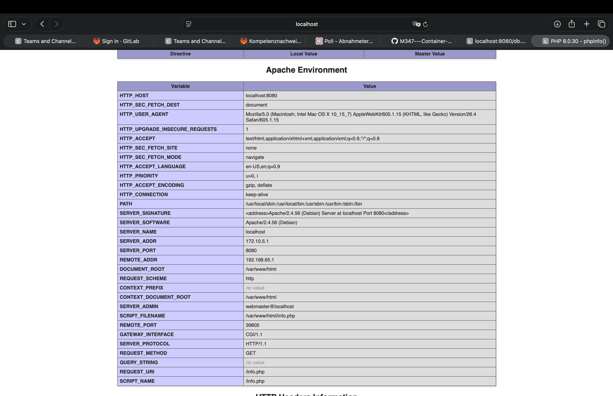
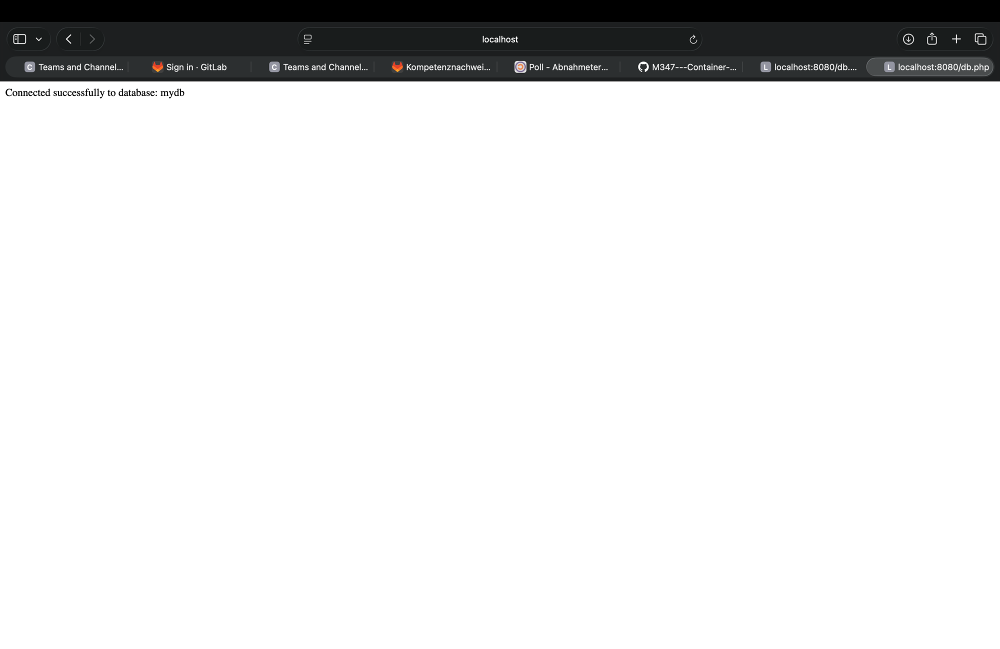
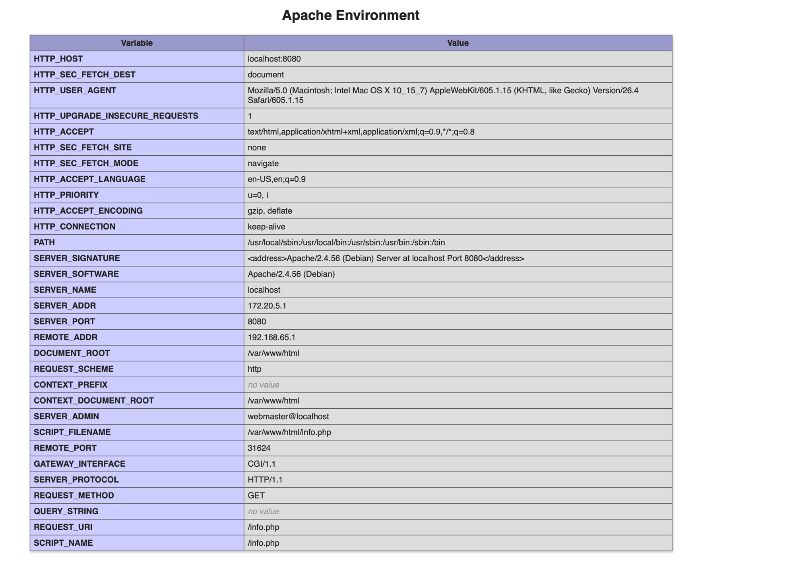
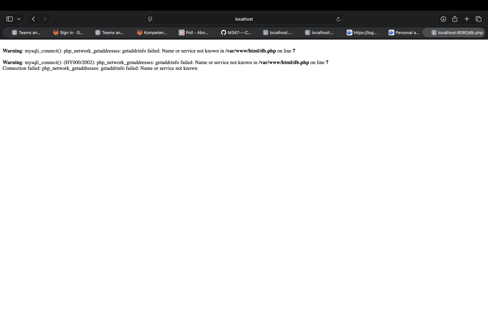
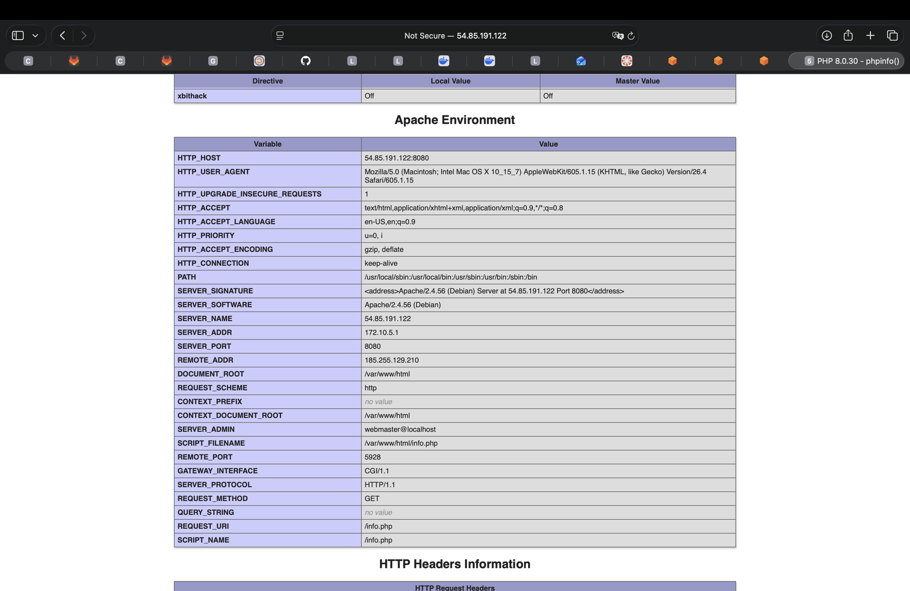
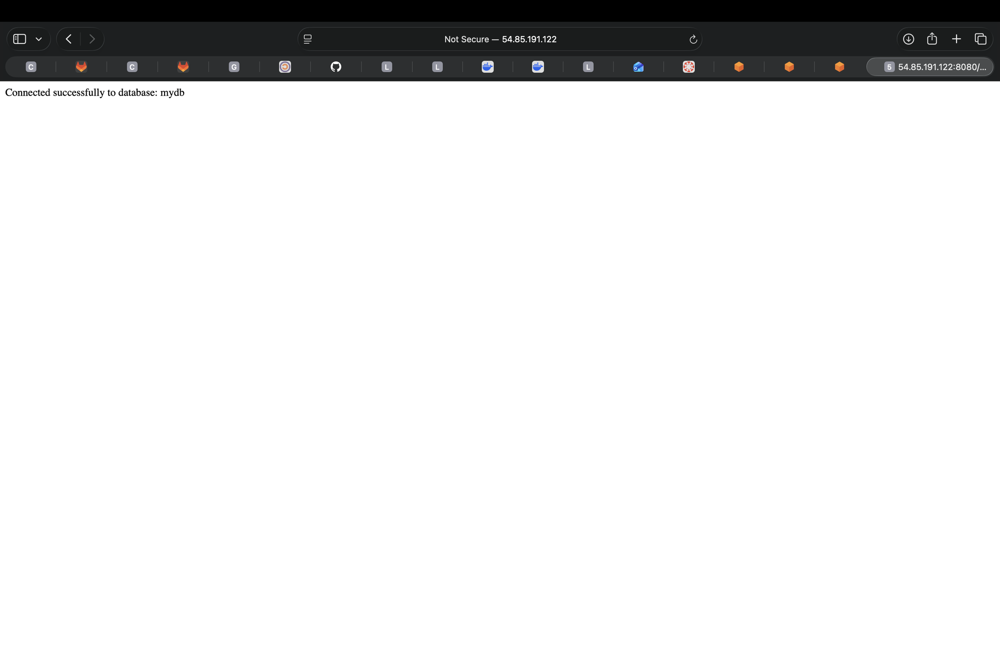

# KN04: Docker Compose

## A) Docker Compose: Lokal

### Teil a) Verwendung von Original Images

Statt die beiden Container wie in KN02 einzeln zu starten, beschreibt eine YAML-Datei die ganze Umgebung und `docker compose up` startet alles in einem Rutsch.

Bedingungen:
- DB direkt über `mariadb:latest` in der Compose-Datei konfiguriert (kein Dockerfile).
- Webserver über ein eigenes Dockerfile (`build`), basierend auf der Datei aus KN02.
- Container-Namen `m347-kn04a-web` und `m347-kn04a-db`.
- Eigenes Netzwerk mit `subnet 172.10.0.0/16`, `ip_range 172.10.5.0/24`, `gateway 172.10.5.254`.

**docker-compose.yml** (`a/docker-compose.yml`)

```yaml
services:
  web:
    build: ./web
    container_name: m347-kn04a-web
    ports:
      - "8080:80"
    networks:
      - kn04a-net
    depends_on:
      - db

  db:
    image: mariadb:latest
    container_name: m347-kn04a-db
    environment:
      MYSQL_ROOT_PASSWORD: root1234
      MYSQL_DATABASE: mydb
      MYSQL_USER: dbuser
      MYSQL_PASSWORD: dbpassword
    networks:
      - kn04a-net

networks:
  kn04a-net:
    driver: bridge
    ipam:
      config:
        - subnet: 172.10.0.0/16
          ip_range: 172.10.5.0/24
          gateway: 172.10.5.254
```

**Dockerfile Webserver** (`a/web/Dockerfile`)

```dockerfile
FROM php:8.0-apache
WORKDIR /var/www/html
COPY info.php .
COPY db.php .
RUN docker-php-ext-install mysqli
EXPOSE 80
```

In `db.php` zeigt `$host` auf den Container-Namen der Datenbank (`m347-kn04a-db`), den die eingebaute DNS des Compose-Netzwerks auflöst.

Starten:

```bash
docker compose up -d --build
```

Beide Container erhalten IPs aus dem `ip_range` (web `172.10.5.1`, db `172.10.5.0`), Gateway `172.10.5.254`.

**Screenshots**

`info.php` mit sichtbarem `REMOTE_ADDR` und `SERVER_ADDR` (`SERVER_ADDR = 172.10.5.1` = IP des Web-Containers im Netzwerk):



`db.php` – beide Images sind im gleichen Netzwerk, die Verbindung klappt:



### Was macht `docker compose up`?

`docker compose up` ist eine Zusammenfassung mehrerer einzelner Schritte:

| Schritt | Entspricht | Bedeutung |
|---------|-----------|-----------|
| Build | `docker compose build` (bzw. `docker build`) | Baut die Images, für die ein `build:` definiert ist (hier den Webserver). Mit `--build` wird immer neu gebaut. |
| Pull | `docker compose pull` (bzw. `docker pull`) | Holt Images, die nur als `image:` angegeben sind und lokal fehlen (hier `mariadb:latest`). |
| Netzwerk anlegen | `docker network create` | Erstellt die in `networks:` definierten Netzwerke (hier `kn04a-net` mit Subnet/Range/Gateway). |
| Volumes anlegen | `docker volume create` | Erstellt die definierten Volumes (hier keine). |
| Container erstellen | `docker create` | Erstellt die Container aus den Images mit Namen, Ports, Env, Netzwerk. |
| Container starten | `docker start` | Startet die erstellten Container. |
| Logs anhängen | `docker attach` / Log-Aggregation | Ohne `-d` werden die Ausgaben aller Container im Vordergrund zusammengeführt. |

### Teil b) Verwendung Ihrer eigenen Images

Die KN02-Images wurden auf Docker Hub publiziert (`jojoondocker/m347:kn02b-web`, `jojoondocker/m347:kn02b-db`). Für den Webserver braucht es jetzt kein Dockerfile mehr – die Compose-Datei verwendet direkt das publizierte Image. Es wird ein anderer IP-Range (`172.20.0.0/16`) verwendet.

**docker-compose.yml** (`b/docker-compose.yml`)

```yaml
services:
  web:
    image: jojoondocker/m347:kn02b-web
    container_name: m347-kn04b-web
    ports:
      - "8080:80"
    networks:
      - kn04b-net
    depends_on:
      - db

  db:
    image: mariadb:latest
    container_name: m347-kn04b-db
    environment:
      MYSQL_ROOT_PASSWORD: root1234
      MYSQL_DATABASE: mydb
      MYSQL_USER: dbuser
      MYSQL_PASSWORD: dbpassword
    networks:
      - kn04b-net

networks:
  kn04b-net:
    driver: bridge
    ipam:
      config:
        - subnet: 172.20.0.0/16
          ip_range: 172.20.5.0/24
          gateway: 172.20.5.254
```

**Screenshots**

`info.php` (jetzt `SERVER_ADDR = 172.20.5.1`):



`db.php` – es erscheint ein Fehler:



```
mysqli_connect(): php_network_getaddresses: getaddrinfo failed: Name or service not known
Connection failed: php_network_getaddresses: getaddrinfo failed: Name or service not known
```

### Warum tritt der Fehler auf?

Im publizierten Web-Image ist `db.php` mit `$host = "kn02b-db"` **fest einkompiliert** (zum Build-Zeitpunkt). In Teil b heisst der Datenbank-Container aber `m347-kn04b-db` und liegt in einem neuen Netzwerk – einen Container/Service namens `kn02b-db` gibt es hier nicht. Die eingebaute DNS kann den Namen nicht auflösen → `getaddrinfo failed` → die Verbindung scheitert.

Weil das fertige Image direkt verwendet wird (kein Dockerfile, kein Rebuild), lässt sich `db.php` nicht wie in Teil a anpassen.

**Lösungsmöglichkeiten**

1. Den DB-Container/Service `kn02b-db` nennen oder dem db-Service einen Netzwerk-Alias `kn02b-db` geben, damit der einkompilierte Name aufgelöst wird.
2. Den Host in `db.php` über eine Environment-Variable konfigurierbar machen (`getenv("DB_HOST")`) und in Compose setzen – dann läuft dasselbe Image in jeder Umgebung.
3. Das Image mit korrektem Host neu bauen und neu publizieren.

## B) Docker Compose: Cloud

Die Lösung aus Teil a wurde per Cloud-Init auf einer AWS-EC2-Instanz (Ubuntu 22.04 LTS) deployt. Ausgegangen wurde vom vorbereiteten Cloud-Init (installiert Docker). Erweitert wurden:

- **`ssh_authorized_keys`**: eigener Public Key zusätzlich zum Schlüssel der Lehrperson eingetragen.
- **`write_files`**: `docker-compose.yml`, `web/Dockerfile`, `web/db.php` und `web/info.php` werden nach `/opt/app` geschrieben.
- **`runcmd`**: nach der Docker-Installation `cd /opt/app && docker compose up -d --build`.

Vollständige Datei: `cloud/cloud-init.yaml`.

Ablauf auf der Instanz:
1. EC2-Instanz mit Ubuntu starten, Security Group offen für Port 22 (SSH) und 8080 (Web), Cloud-Init als User-Data.
2. Cloud-Init installiert Docker, schreibt die Dateien, baut das Web-Image und startet den Stack.
3. Fertig, sobald in `/var/log/cloud-init-output.log` die `final_message` erscheint: `The system is finally up, after ... seconds`.

**Screenshots** (URL = öffentliche IP der Instanz)

`info.php` (`SERVER_ADDR = 172.10.5.1` im Container-Netzwerk, `REMOTE_ADDR` = eigene öffentliche IP):



`db.php` in der Cloud – Verbindung erfolgreich:


