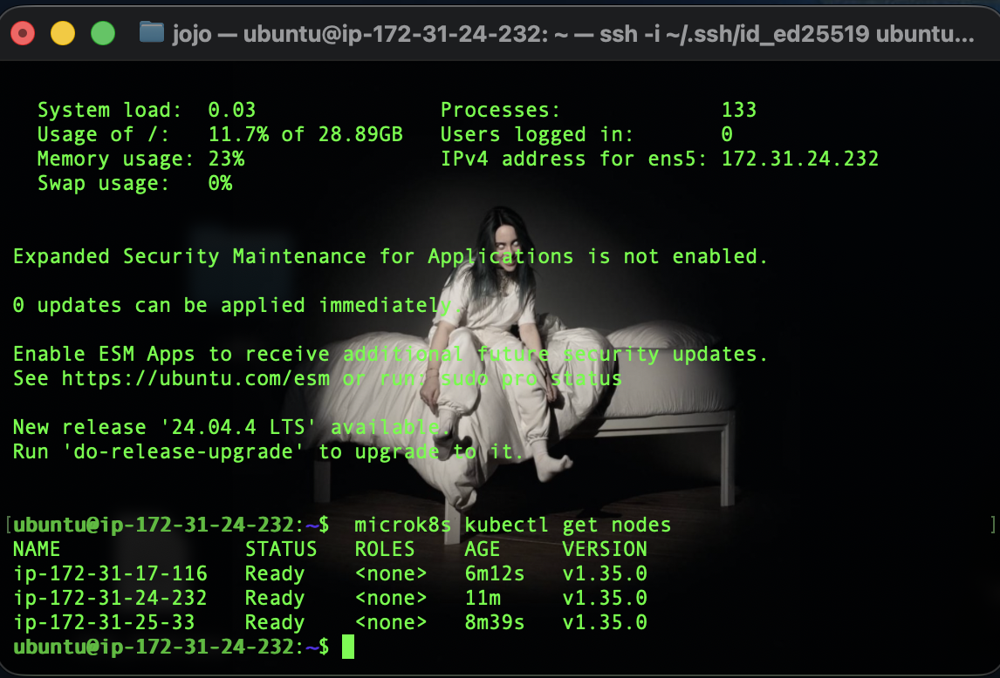
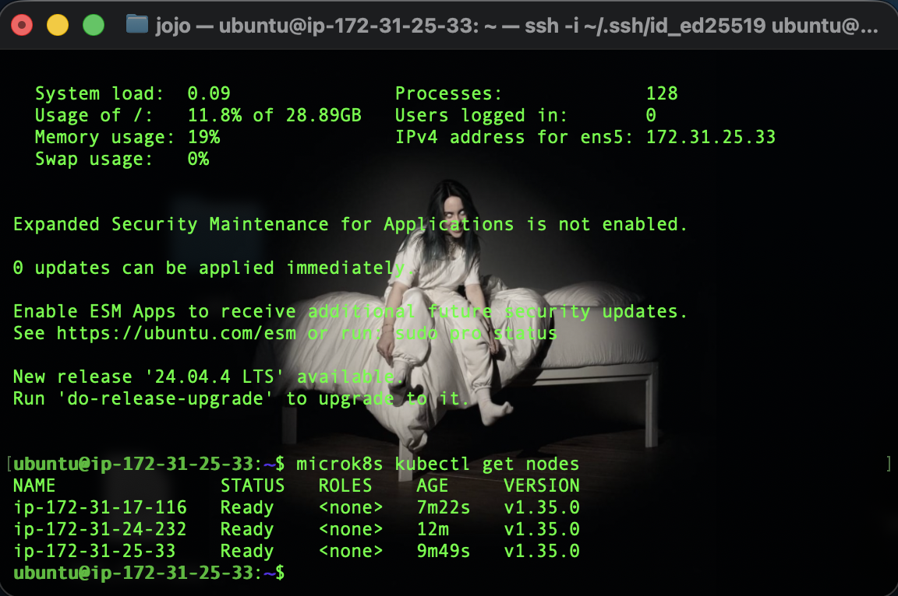
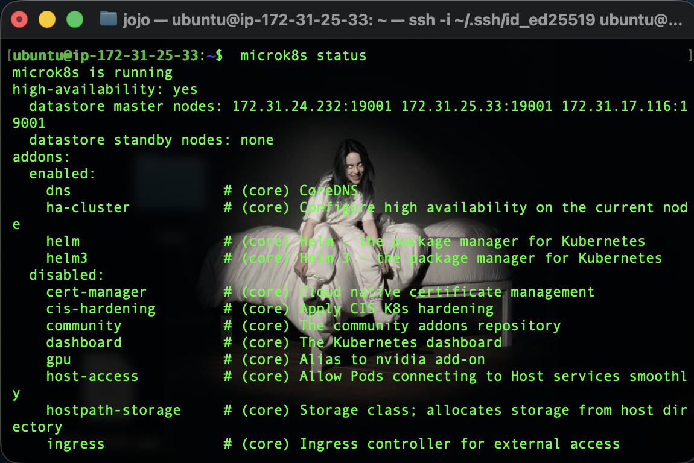
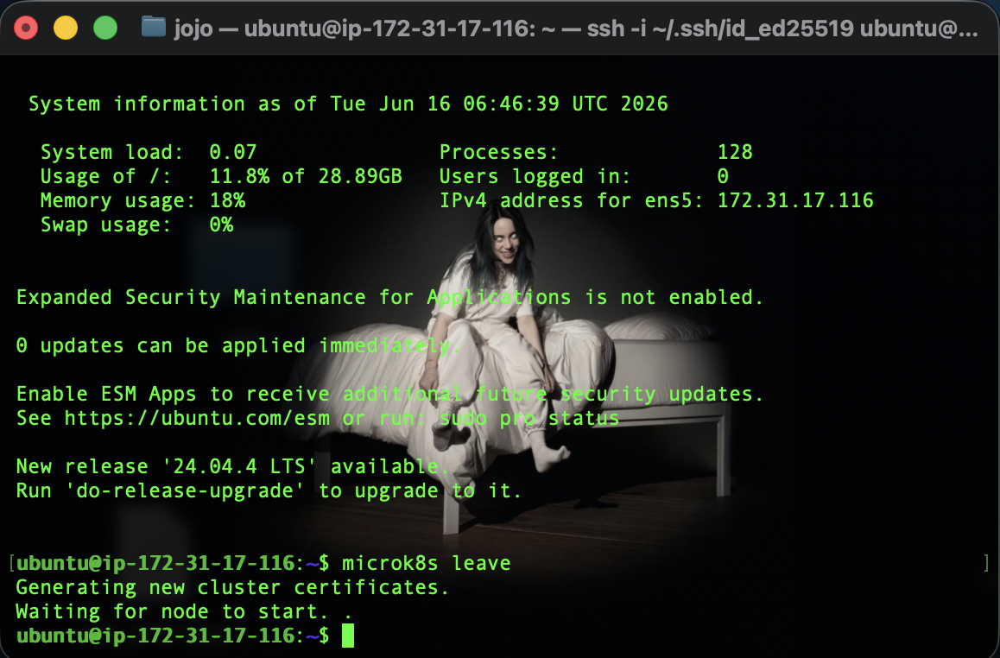
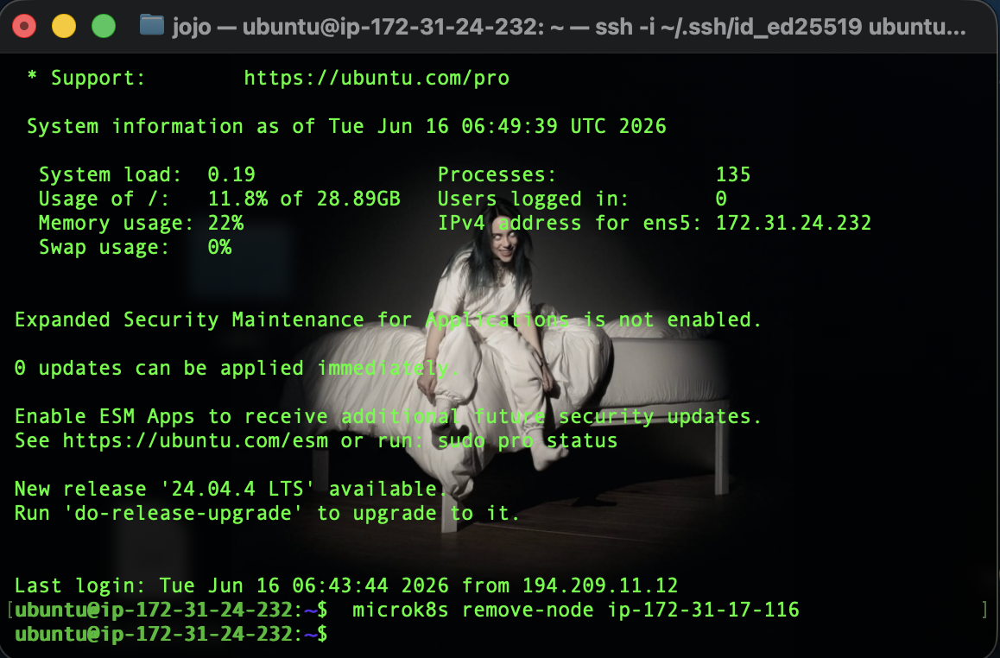
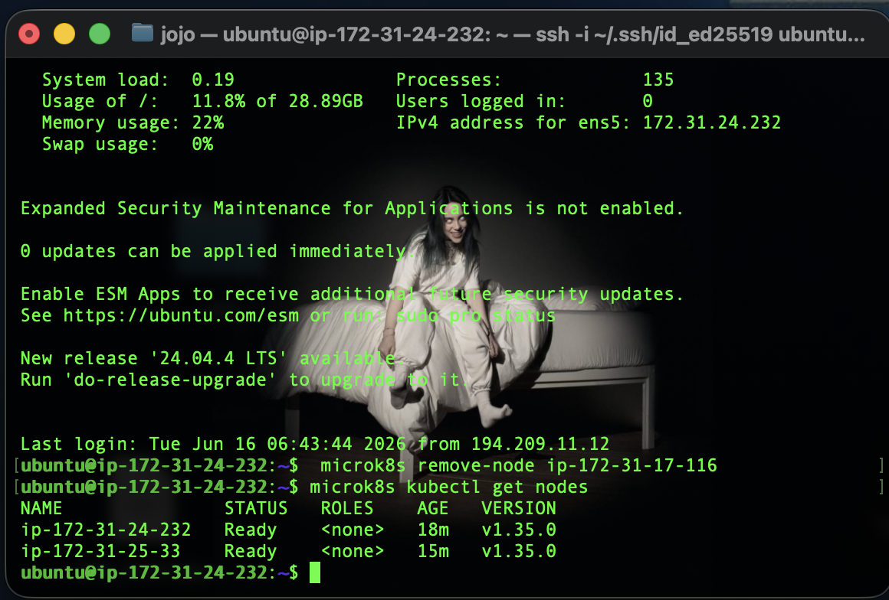
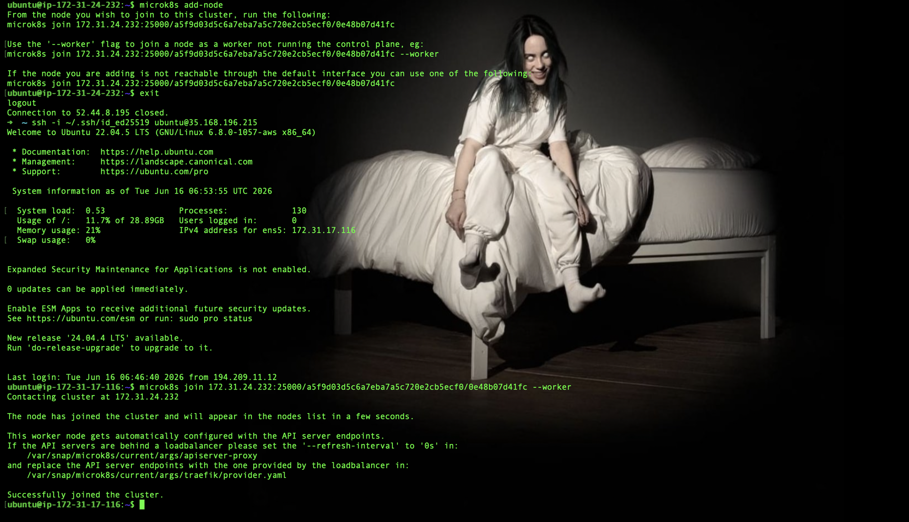
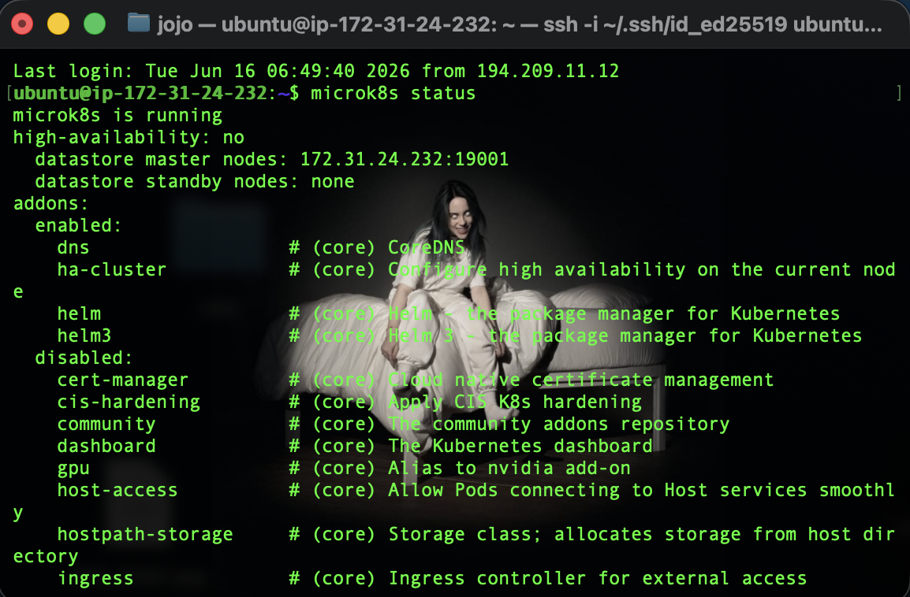
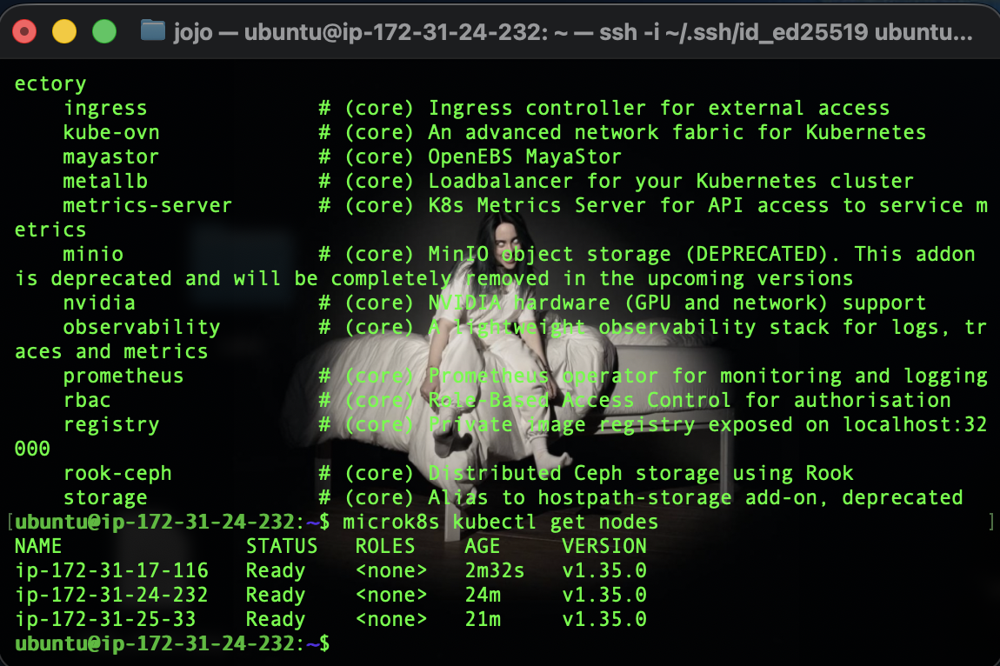
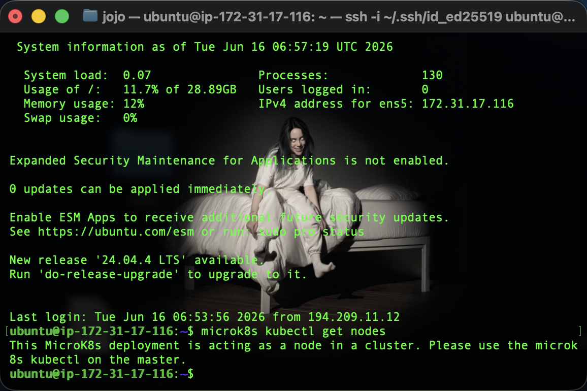

# KN06: Kubernetes I

Ein hochverfügbarer MicroK8s-Cluster aus **drei Nodes** auf AWS EC2.

## Aufbau (Infrastruktur)

Drei EC2-Instanzen (Ubuntu 22.04 LTS, `t3.medium` = 2 vCPU / 4 GB RAM, 30 GB Disk) im selben VPC. Jede Instanz hat eine statische private IP und eine statische öffentliche IP (Elastic IP). Die Security Group `kn06-microk8s` erlaubt SSH (22), den Kubernetes-API-Port (16443) und **sämtlichen Verkehr zwischen den Nodes** (self-referencing), damit die Cluster-Kommunikation nicht blockiert wird.

| Node | Rolle | Public IP (statisch) | Private IP | Hostname |
|------|-------|----------------------|------------|----------|
| node1 | Master | 52.44.8.195 | 172.31.24.232 | ip-172-31-24-232 |
| node2 | (Control-Plane) | 44.222.8.242 | 172.31.25.33 | ip-172-31-25-33 |
| node3 | (Control-Plane) | 35.168.196.215 | 172.31.17.116 | ip-172-31-17-116 |

Installiert wird MicroK8s per Cloud-Init (`cloud/cloud-init.yaml`): `snap install microk8s --classic`, der User `ubuntu` wird in die Gruppe `microk8s` aufgenommen (kann `microk8s` somit ohne `sudo` aufrufen), und es wird ein Alias `kubectl='microk8s kubectl'` gesetzt. Zusätzlich zum Schlüssel der Lehrperson wurde der eigene Public Key eingetragen.

## A) Installation

Cluster gemäss [MicroK8s: Create a Cluster](https://microk8s.io/docs/clustering) gebildet:

```bash
# Auf dem Master (node1) einen Join-Token erzeugen:
microk8s add-node
# -> gibt einen Befehl der Form:  microk8s join 172.31.24.232:25000/<token>/<hash>

# Auf node2 diesen Befehl ausführen (über die private IP des Masters):
microk8s join 172.31.24.232:25000/<token>/<hash>

# Auf dem Master erneut add-node, neuen Token auf node3 ausführen:
microk8s add-node
microk8s join 172.31.24.232:25000/<token>/<hash>
```

Jeder `add-node`-Token ist **einmalig**; deshalb wird vor jedem Join ein neuer erzeugt. Da alle drei Nodes ohne `--worker` beitreten, werden sie zu Control-Plane-Nodes – ab drei voting members aktiviert MicroK8s automatisch Hochverfügbarkeit.

**Abgabe:** `microk8s kubectl get nodes` auf node1 – alle drei Nodes sind `Ready`:



## B) Verständnis für Cluster

### Unterschied `microk8s` vs. `microk8s kubectl`

- **`microk8s`** ist das Verwaltungswerkzeug für die MicroK8s-*Installation und die Nodes selbst*: Lebenszyklus des Clusters (`add-node`, `join`, `leave`, `remove-node`), Zustand des Dienstes (`status`, `start`, `stop`) und Addons (`enable`/`disable`). Es verwaltet also die **Infrastruktur** des Clusters.
- **`microk8s kubectl`** ist das in MicroK8s eingebettete Standard-`kubectl` von Kubernetes. Damit verwaltet man die **Workloads/Ressourcen im Cluster** (Pods, Deployments, Services, die Node-Objekte …); es spricht mit dem Kubernetes-API-Server. Weil `kubectl` in MicroK8s eingebettet ist, ruft man es über das Präfix `microk8s kubectl` (oder per Alias `kubectl`) auf.

Kurz: `microk8s` = den Cluster betreiben/administrieren, `microk8s kubectl` = im Cluster arbeiten.

### 1. `get nodes` auf einer zweiten Instanz

`microk8s kubectl get nodes` auf node2 – es erscheint dieselbe Liste wie auf node1, weil beide denselben Cluster-Zustand abfragen:



### 2. `microk8s status` (vor "addons")

```
microk8s is running
high-availability: yes
  datastore master nodes: 172.31.24.232:19001 172.31.25.33:19001 172.31.17.116:19001
  datastore standby nodes: none
```



**Bedeutung der Zeilen:**
- `microk8s is running` – der MicroK8s-Dienst läuft.
- `high-availability: yes` – Hochverfügbarkeit ist aktiv. MicroK8s speichert den Cluster-Zustand in einer verteilten Datenbank (**dqlite**). HA wird automatisch eingeschaltet, sobald **mindestens 3 Nodes als Control-Plane (voting members)** im Cluster sind. Mit 3 voting members verträgt der Cluster den Ausfall **eines** Nodes (Quorum = Mehrheit, also 2 von 3).
- `datastore master nodes` – die Nodes, die eine Kopie der dqlite-Datenbank halten und am Quorum/Voting teilnehmen. Hier alle drei.
- `datastore standby nodes` – Reserve-Nodes, die die Datenbank replizieren, aber nicht voten; sie rücken nach, wenn ein master node ausfällt. Hier `none`, weil bereits alle drei voten.

### 3. Einen Node aus dem Cluster entfernen

Das Entfernen geschieht in zwei Schritten:

```bash
# auf dem zu entfernenden Node (node3) – Node verlässt den Cluster:
microk8s leave

# danach auf dem Master (node1) – den Node aus der Cluster-DB austragen:
microk8s remove-node ip-172-31-17-116
```





Kontrolle: `microk8s kubectl get nodes` auf node1 zeigt jetzt nur noch zwei Nodes:



### 4. Node wieder als **Worker** hinzufügen

```bash
# auf dem Master einen neuen Token erzeugen:
microk8s add-node

# auf node3 mit --worker beitreten:
microk8s join 172.31.24.232:25000/<token>/<hash> --worker
```

Ein Worker führt **keine** Control-Plane / kein dqlite aus – er stellt nur Rechenkapazität (kubelet) bereit.



> Damit der Cluster wie in der Aufgabe gefordert am Ende aus **einer Master-Node und zwei Worker-Nodes** besteht, wurde anschliessend **node2 auf dieselbe Weise** umgewandelt (`microk8s leave` auf node2, `microk8s remove-node ip-172-31-25-33` auf dem Master, dann `microk8s join … --worker` auf node2). Endzustand: node1 = Master, node2 + node3 = Worker.

### 5. `microk8s status` nach der Worker-Umwandlung

```
microk8s is running
high-availability: no
  datastore master nodes: 172.31.24.232:19001
  datastore standby nodes: none
```



**Unterschied und Ursache:** `high-availability` steht jetzt auf **`no`** (vorher `yes`) und in der Liste der `datastore master nodes` ist nur noch **ein** Node (node1) aufgeführt – vorher waren es drei. Grund: Hochverfügbarkeit braucht **mindestens drei** Control-Plane-Nodes (voting members), um bei einem Ausfall ein sicheres Quorum (Mehrheit, Schutz vor Split-Brain) zu bilden. Durch das Entfernen von node3 und das Wiederhinzufügen als **Worker** ist diese Schwelle unterschritten: node3 läuft als Worker komplett ohne Control-Plane/dqlite, und da der Cluster unter der HA-Grenze liegt, schaltet MicroK8s HA ab und betreibt den verteilten Speicher (dqlite) nur noch mit einem stimmberechtigten master node. Genau das zeigt die Statuszeile.

### 6. `get nodes` auf Master und Worker

`microk8s kubectl get nodes` auf dem **Master** (node1):



`microk8s kubectl get nodes` auf dem **Worker** (node3) – hier kommt **keine** Node-Liste, sondern der Hinweis:

```
This MicroK8s deployment is acting as a node in a cluster.
Please use the microk8s kubectl on the master.
```



**Warum stimmt das mit `microk8s status` überein?** Auf dem **Master** listet `get nodes` den gesamten Cluster auf (alle drei Nodes `Ready`), weil der Master den Kubernetes-API-Server und die Cluster-Datenbank (dqlite) betreibt und die Anfrage beantworten kann. Der **Worker** dagegen führt **keine** Control-Plane / keinen API-Server aus – genau das hat `microk8s status` mit `high-availability: no` und nur einem datastore master node bereits gezeigt: Der Worker ist kein Control-Plane-/Datastore-Node. Deshalb kann `microk8s kubectl` auf dem Worker die Cluster-Frage nicht selbst beantworten und verweist konsequent auf den Master. Das eine (Worker hat keine Control-Plane laut `status`) bedingt also das andere (Worker kann `get nodes` nicht ausführen) – beide Befehle zeigen dieselbe Rollenverteilung im Cluster.

> 🚨 Dieser Cluster wird in **KN07** weiterverwendet (Details und IPs siehe `cloud/instances.txt`).
