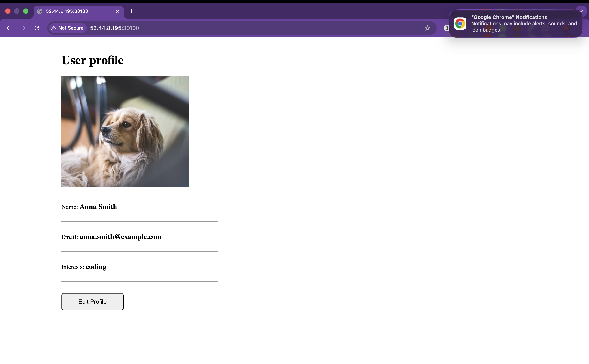
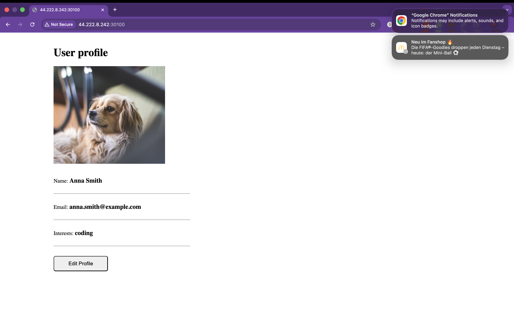
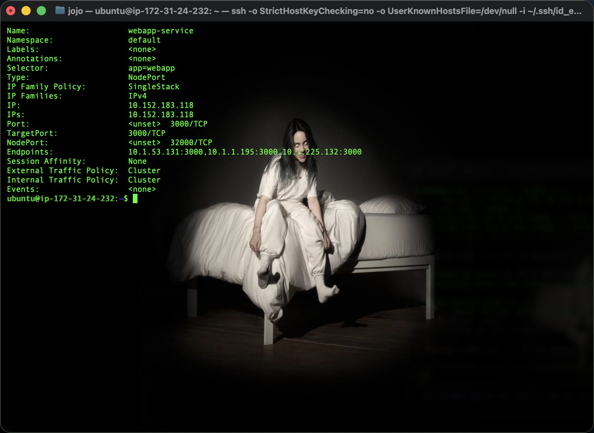

# KN07: Kubernetes II

Demo-Projekt (WebApp + MongoDB) auf dem 3-Node-MicroK8s-Cluster aus KN06.

> **Cluster-Hinweis:** KN06 endete mit 1 Master + 2 Worker. KN07 verlangt aber `microk8s kubectl` auf **mindestens zwei Nodes** – und ein **Worker** kann `microk8s kubectl` nicht ausführen (er antwortet *„use the microk8s kubectl on the master"*). Darum wurde der Cluster für KN07 wieder auf **drei Control-Plane-Nodes (HA)** gebracht (node2 + node3 jeweils `leave` → `remove-node` → `join` **ohne** `--worker`). Jetzt läuft `kubectl` auf allen drei Nodes. Node-IPs siehe `../KN06/cloud/instances.txt`.

---

## A) Begriffe und Konzepte

### 1. Pod vs. Replica

Ein **Pod** ist die kleinste deploybare Einheit in Kubernetes. Er umhüllt einen (selten mehrere eng gekoppelte) Container mit gemeinsamer IP, gemeinsamem Netzwerk und Storage. Ein Pod ist **vergänglich**: stirbt er, ist genau diese Instanz weg.

Eine **Replica** ist eine von mehreren **identischen Kopien** desselben Pods. Wie viele Kopien laufen sollen, legt man über `replicas` fest; ein **ReplicaSet** (vom Deployment erzeugt) sorgt dafür, dass immer genau diese Anzahl läuft – fällt ein Pod aus, wird automatisch ein neuer gestartet.

**Unterschied:** Der Pod ist die konkrete laufende Einheit („**was** läuft"), Replica ist die **Anzahl gleichartiger Pods** („**wie viele** Kopien davon"). Replicas dienen der Skalierung und Ausfallsicherheit.

### 2. Service vs. Deployment

Ein **Deployment** verwaltet den **Lebenszyklus von Pods**: Es erstellt Pods nach einem Blueprint (Template), hält die gewünschte `replicas`-Zahl, und ermöglicht Rolling Updates und Rollbacks. Es kümmert sich also um *welche und wie viele Pods laufen*.

Ein **Service** ist eine **stabile Netzwerk-Adresse** (feste ClusterIP + DNS-Name) vor einer Gruppe von Pods. Da Pods kommen und gehen und dabei ihre IPs wechseln, bietet der Service einen **gleichbleibenden Endpunkt** und verteilt (load-balanced) Anfragen über `selector`/Labels auf die passenden Pods.

**Unterschied:** Deployment = Pods erzeugen/am Leben halten (Compute & Lifecycle). Service = diese Pods stabil **erreichbar** machen (Netzwerk & Load-Balancing). Das eine läuft ohne das andere – ein Deployment ohne Service ist von aussen/anderen Pods nur schwer ansprechbar; ein Service ohne passende Pods leitet ins Leere.

### 3. Welches Problem löst Ingress?

Ohne Ingress macht man jeden Service einzeln nach aussen verfügbar – per `NodePort` (ein Port pro Service auf jedem Node) oder `LoadBalancer` (eine externe IP pro Service). Bei vielen Services wird das schnell unübersichtlich: viele Ports/IPs, kein sauberes URL-Routing, und TLS müsste man pro Service einzeln lösen.

**Ingress** löst das mit **einem einzigen Eintrittspunkt** für HTTP/HTTPS: Ein Ingress-Controller nimmt den gesamten Web-Verkehr entgegen und leitet ihn nach **Host- bzw. Pfad-Regeln** an die internen Services weiter (z. B. `app.example.com` → `webapp-service`, `example.com/api` → `api-service`). Zusätzlich kann **TLS/SSL zentral** terminiert werden. Statt pro Service einen externen Port/LoadBalancer braucht man so nur noch einen Eintrittspunkt mit sauberen URLs.

### 4. Wofür ist ein StatefulSet? (Beispiel ohne Datenbank)

Ein **StatefulSet** ist für **zustandsbehaftete** Anwendungen, deren Pods – anders als beim Deployment – **nicht austauschbar** sind. Es garantiert:
- **stabile, eindeutige Pod-Namen/Netzwerk-Identität** (`pod-0`, `pod-1`, … bleiben über Neustarts erhalten),
- **eigenen, dauerhaft zugeordneten Speicher** pro Pod (jeder Pod sein eigenes PersistentVolume),
- **geordnetes** Starten, Skalieren und Aktualisieren.

**Beispiel (keine DB):** Ein **Apache-Kafka-Cluster** (Message-Broker). Jeder Broker braucht eine feste Identität (damit Partitionen/Leader stabil zugeordnet bleiben) und seinen **eigenen persistenten Log-Speicher** – genau das, was ein StatefulSet liefert. (Ebenso: ein ZooKeeper- oder Elasticsearch-Cluster.)

---

## B) Demo-Projekt

### Aufbau

Vier Manifeste (in `k8s/`) – innerhalb des Clusters spricht die WebApp über den **internen** Service mit MongoDB; nach aussen ist die WebApp über einen **NodePort**-Service erreichbar:

| # | Datei | Inhalt |
|---|-------|--------|
| 1 | `k8s/mongo-config.yaml` | **ConfigMap** – MongoDB-Endpoint (`mongo-url: mongo-service`) |
| 2 | `k8s/mongo-secret.yaml` | **Secret** – MongoDB-User/Passwort (base64) |
| 3 | `k8s/mongo.yaml` | **Deployment + Service** MongoDB (interner ClusterIP-Service, Port 27017) |
| 4 | `k8s/webapp.yaml` | **Deployment + Service** WebApp (NodePort 30100 → Container 3000) |

**Installiert mit** (Reihenfolge wichtig: ConfigMap/Secret zuerst, dann DB, dann WebApp):

```bash
microk8s kubectl apply -f mongo-config.yaml -f mongo-secret.yaml
microk8s kubectl apply -f mongo.yaml
microk8s kubectl apply -f webapp.yaml
microk8s kubectl get all -o wide   # Kontrolle
```

### B1 – Welcher Teil wurde *nicht* wie im Tutorial umgesetzt? (Tipp: Datenbank)

Die **MongoDB** ist als normales **Deployment** (mit ClusterIP-Service) umgesetzt – obwohl eine Datenbank ein **zustandsbehafteter (stateful)** Dienst ist und laut den Konzepten als **StatefulSet mit persistentem Speicher (PersistentVolume)** umgesetzt werden müsste.

**Warum das hier ein Problem wäre:**
- **Kein persistenter Speicher:** Stirbt/restartet der Mongo-Pod, sind **alle Daten weg**, weil der Container-Speicher flüchtig ist (kein PVC angehängt).
- **Keine stabile Identität:** Ein Deployment vergibt zufällige Pod-Namen. Würde man `replicas` der DB erhöhen, entstünden **mehrere unabhängige Mongo-Instanzen ohne gemeinsamen Zustand** → Daten-Inkonsistenz. Ein StatefulSet gäbe jedem DB-Pod feste Identität und eigenen Speicher.

**Warum trotzdem so gemacht:** Für ein **Demo-/Lernprojekt** reicht es. Mit `replicas: 1` und ohne Skalierung zeigt es das Zusammenspiel von ConfigMap, Secret, internem Service und WebApp **einfach und übersichtlich**. Ein StatefulSet + PersistentVolume/StorageClass würde das Beispiel unnötig verkomplizieren. In der Realität gehört eine DB als StatefulSet mit Persistenz (oder als gemanagter DB-Dienst) umgesetzt.

### B2 – Warum ist die `mongo-url` in der ConfigMap korrekt?

In der ConfigMap steht `mongo-url: mongo-service`. Das ist korrekt, weil Kubernetes für **jeden Service** einen **clusterinternen DNS-Namen** bereitstellt, der dem **Service-Namen** (`metadata.name`) entspricht. Der MongoDB-Service heisst `mongo-service`, ist also clusterintern unter dem Hostnamen **`mongo-service`** erreichbar (vollständig: `mongo-service.default.svc.cluster.local`).

Die WebApp liest diesen Wert aus der ConfigMap als Umgebungsvariable `DB_URL` und verbindet sich gegen `mongo-service`. CoreDNS löst den Namen auf die **ClusterIP** des Service auf, der die Anfrage an den Mongo-Pod weiterleitet. Der Wert ist also korrekt, weil er **exakt dem Namen des MongoDB-Service entspricht** – und nicht eine feste IP, die sich bei jedem Pod-Neustart ändern würde.

### B3 – Nachweis der Installation: `describe service` auf zwei Nodes

```bash
microk8s kubectl describe service webapp-service
```

Auf **node1** und **node2** ausführen → zwei Screenshots. Die Ausgabe ist auf **jedem** Control-Plane-Node **identisch**, weil der Service ein **clusterweites Objekt** ist: jeder Node fragt denselben API-Server/dieselbe Cluster-DB.


### B4 – Wie ruft man die Webseite auf?

Auskunft gibt die Service-Definition der WebApp: `type: NodePort` mit `nodePort: 30100`. Ein **NodePort**-Service ist auf **jedem** Node unter dessen IP + Portnummer erreichbar; MicroK8s mappt das automatisch auf die Host-IP. Aufruf:

```
http://<public-ip-eines-nodes>:30100
```

**Was nötig war:** In der AWS-Security-Group den **Port 30100** freigeben (sonst blockt die Firewall den Zugriff von aussen). Danach ist die Seite über die öffentliche IP **jedes** Nodes erreichbar – Screenshot von zwei Nodes (inkl. sichtbarer URL):




### B5 – MongoDB Compass vom eigenen Rechner: warum geht es nicht?

Der MongoDB-Service ist vom Typ **ClusterIP** (Default). ClusterIP bedeutet: **nur clusterintern** erreichbar – es gibt **keinen** nach aussen offenen Port. Vom eigenen Rechner mit MongoDB Compass ist die DB daher nicht erreichbar (zusätzlich ist Port 27017 in der Firewall/Security-Group nicht offen).

**Was man ändern müsste, damit es geht:** Den **mongo-service** von `ClusterIP` auf **`NodePort`** (oder `LoadBalancer`) umstellen und einen `nodePort` (z. B. 30017) vergeben, dann den Port in der Security-Group öffnen. Verbindung dann über `mongodb://mongouser:mongopassword@<node-ip>:<nodePort>`.

> ⚠️ **Sicherheitsaspekt:** Eine Datenbank direkt nach aussen zu exponieren ist in der Praxis **schlecht** – die DB sollte nur clusterintern erreichbar bleiben. Genau deshalb ist sie hier (korrekt) als ClusterIP konfiguriert.

### B6 – Port auf 32000 ändern und `replicas` auf 3 erhöhen

**Schritte:** In `k8s/webapp.yaml` zwei Werte ändern und neu anwenden – `kubectl apply` aktualisiert die bestehenden Objekte (kein Löschen nötig):

```diff
 spec:
-  replicas: 1
+  replicas: 3
```
```diff
     ports:
       - protocol: TCP
         port: 3000
         targetPort: 3000
-        nodePort: 30100
+        nodePort: 32000
```

```bash
microk8s kubectl apply -f webapp.yaml
microk8s kubectl get pods -o wide        # jetzt 3 webapp-Pods
microk8s kubectl describe service webapp-service
```

Aufruf der Seite jetzt über den **neuen** Port: `http://<node-ip>:32000` (Port 32000 ist in der Security-Group bereits offen). Screenshot der funktionierenden Seite (ein Node):


`describe service webapp-service` nach der Änderung:



**Unterschied in den Replicas:** Vorher hatte der Service **eine** Endpoint-IP (ein Pod), jetzt zeigt die Zeile **`Endpoints:`** **drei** Pod-IPs (`…:3000, …:3000, …:3000`) und **`NodePort:`** steht auf **32000**. Grund: `replicas: 3` erzeugt drei WebApp-Pods; der Service findet sie über das Label `app=webapp` und verteilt die Anfragen per Load-Balancing auf alle drei.

---

## Aufräumen (optional)

```bash
microk8s kubectl delete -f webapp.yaml -f mongo.yaml -f mongo-secret.yaml -f mongo-config.yaml
```
