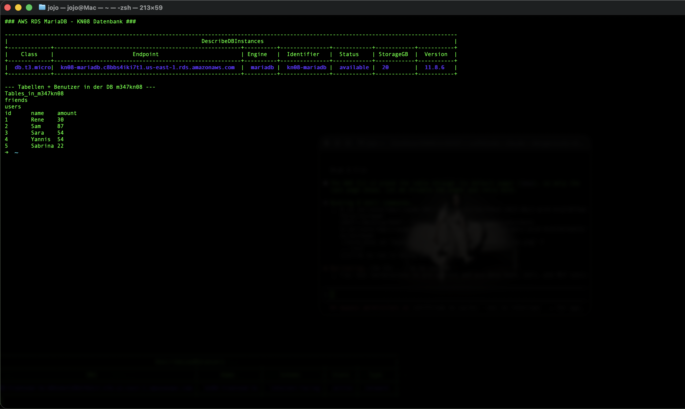
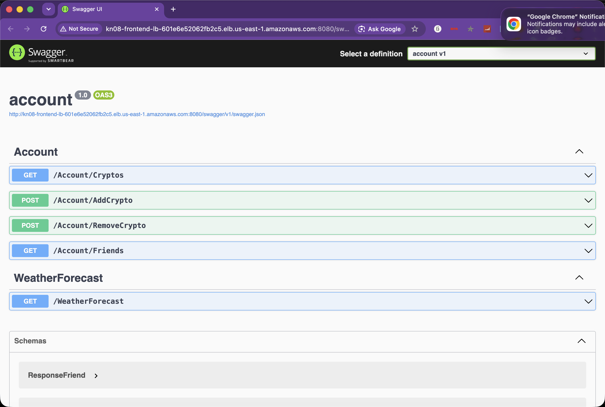
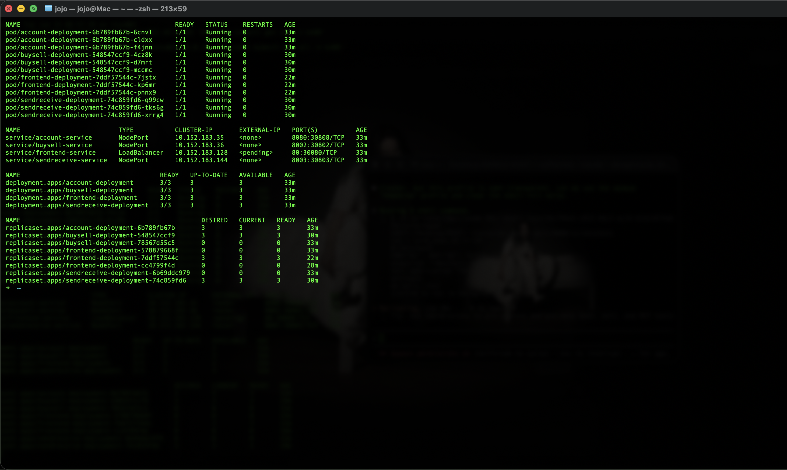
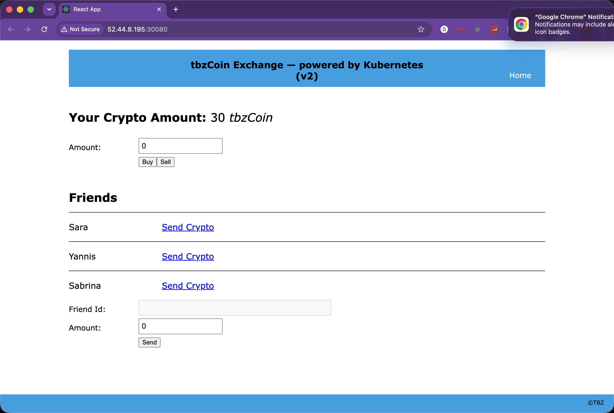
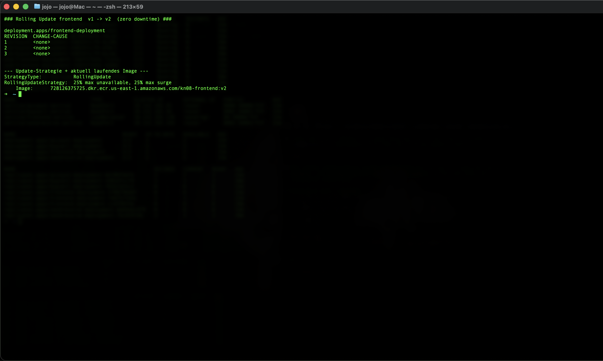
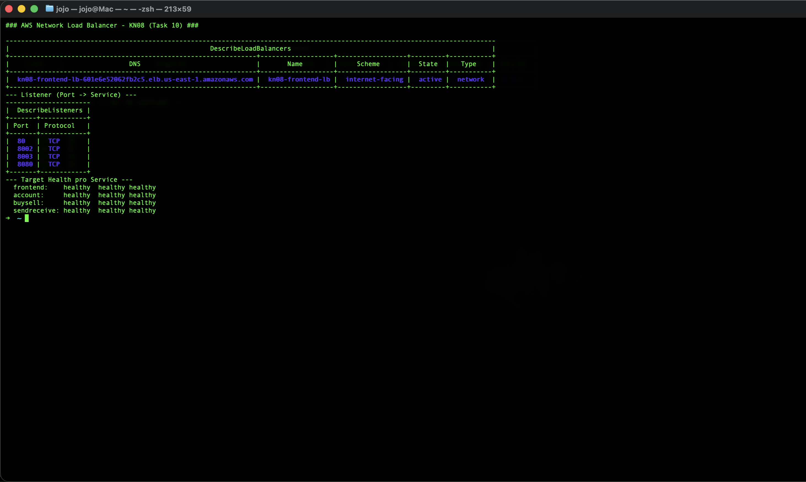
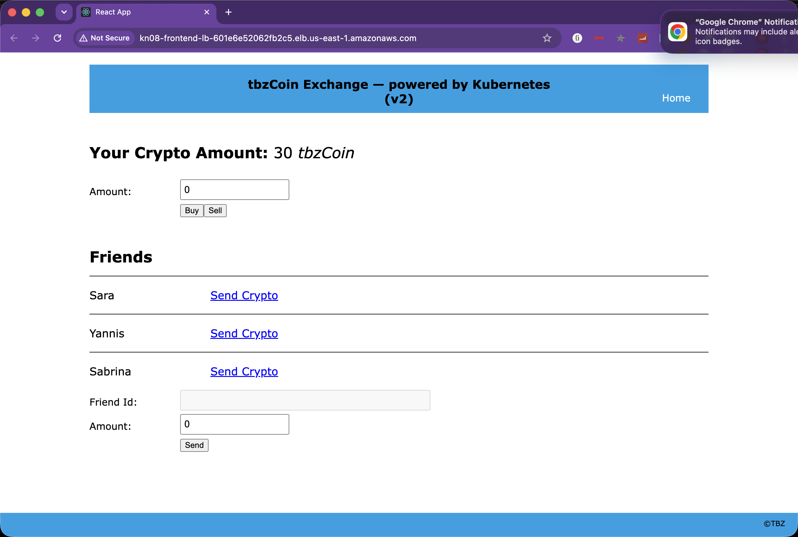

# KN08: Kubernetes III – Microservices

Crypto-Microservice-Applikation (`tbzCoin`, fixer Wert 15 CHF, ganzzahlig) auf dem **3-Node-MicroK8s-Cluster** aus KN06/KN07 (AWS EC2, us-east-1). Vier Microservices arbeiten zusammen:

| Service | Herkunft | Aufgabe | Port |
|---------|----------|---------|------|
| **frontend** | vorgegeben (React) | UI – ruft die anderen Services im Browser auf | 80 |
| **account** | vorgegeben (.NET 8) | **einziger** Service mit DB-Zugriff: Holdings & Friends | 8080 |
| **BuySell** | **selbst implementiert** (Node/Express) | tbzCoins kaufen/verkaufen | 8002 |
| **SendReceive** | **selbst implementiert** (Node/Express) | tbzCoins an Freunde senden | 8003 |

> Damit KN07 (Namespace `default`) weiterläuft, wurde KN08 in einen **eigenen Namespace `kn08`** deployt.

**Verwendete Infrastruktur (alles in AWS, Account 728126375725, us-east-1):**
- **Datenbank:** AWS **RDS MariaDB** `kn08-mariadb` (db.t3.micro, Sandbox/free)
- **Container-Registry:** AWS **ECR** (`728126375725.dkr.ecr.us-east-1.amazonaws.com/kn08-*`)
- **Load Balancer:** AWS **Network Load Balancer** `kn08-frontend-lb`

---

## 1 Datenbank erstellen (RDS MariaDB)

In AWS RDS wurde eine **MariaDB** (Engine `mariadb`, Klasse `db.t3.micro`, 20 GB, Single-AZ, free) erstellt: `kn08-mariadb`. Eine eigene Security-Group (`kn08-rds-sg`) erlaubt Port **3306** nur von der Cluster-Security-Group und der eigenen IP.

Die vorgegebenen Beispieldaten (`database/m347_KN08_DB.sql`) wurden eingespielt – sie legen die DB `m347kn08` mit den Tabellen `users` (5 Benutzer) und `friends` (Freundschaften) an:

```bash
mysql --ssl -h kn08-mariadb.c8bbs4iki7t1.us-east-1.rds.amazonaws.com -u admin -p < m347_KN08_DB.sql
```

> **Hinweis:** RDS erzwingt `require_secure_transport=ON`, daher die Verbindung **mit TLS** (`--ssl`). Der Account-Service (MySqlConnector, `SslMode=Preferred`) verbindet sich standardmässig verschlüsselt.



## 2 Frontend builden und containerisieren

Das React-Frontend wird **nicht** mehr manuell mit `npm run build` gebaut – das übernimmt das **Multistage-Dockerfile** (siehe Task 9). Die Umgebungsvariablen kommen zur Laufzeit aus Kubernetes (ConfigMap), nicht hardcodiert.

## 3 Account-Komponente containerisieren

Der vorgegebene Account-Service (kompilierte .NET-8-DLL) wird mit dem vorgegebenen Dockerfile gebaut. Die DB-Verbindung wird **nicht** mehr über `appsettings.json` gesetzt, sondern als **Umgebungsvariable `ConnectionString`** aus einem **Secret** injiziert (ASP.NET Core mappt eine ENV-Variable `ConnectionString` automatisch auf den gleichnamigen Konfigschlüssel).

Die Endpoints (Swagger unter `:8080/swagger/`):

| Methode | Endpoint | Parameter | Antwort |
|---------|----------|-----------|---------|
| GET | `/Account/Cryptos` | `?userId=` (Query) | Integer (Anzahl Coins) |
| GET | `/Account/Friends` | `?userId=` (Query) | `[{id,name}]` |
| POST | `/Account/AddCrypto` | `?userId=&amount=` (**Query!**) | true/false |
| POST | `/Account/RemoveCrypto` | `?userId=&amount=` (**Query!**) | true/false |

> **Wichtigste Erkenntnis aus Swagger:** `AddCrypto`/`RemoveCrypto` erwarten die Parameter im **Query-String** (`?userId=1&amount=21`), **nicht** im JSON-Body. Genau darauf rufen BuySell und SendReceive den Account-Service auf.



## 4/5 Integration

Alle vier Container wurden gebaut, nach **ECR** gepusht und im Cluster getestet. Die Images werden nativ auf einem EC2-Node (amd64) gebaut:

```bash
aws ecr get-login-password | docker login --username AWS --password-stdin 728126375725.dkr.ecr.us-east-1.amazonaws.com
docker build -t .../kn08-buysell:v1 ./buysell && docker push .../kn08-buysell:v1
# analog für account, sendreceive, frontend
```

## 6 BuySell und SendReceive implementieren (20%)

Beide Services sind in **Node.js / Express** umgesetzt (`buysell/server.js`, `sendreceive/server.js`). Die URL des Account-Service kommt aus der Umgebungsvariable **`ACCOUNT_BASE_URL`** (ConfigMap) – nichts ist hardcodiert. CORS ist offen (`Access-Control-Allow-Origin: *`), da der Browser die Services direkt aufruft.

### BuySell (`/buy`, `/sell`, Port 8002)

- **`POST /buy`** `{"id":1,"amount":21}` → ruft `AddCrypto?userId=1&amount=21` auf → `true`. Der Benutzer hat „unendlich Geld", also keine Obergrenze beim Kauf.
- **`POST /sell`** `{"id":1,"amount":21}` → liest zuerst den Kontostand (`Cryptos`); es wird **maximal der vorhandene Bestand** verkauft (`min(amount, balance)`) → bei „mehr verkaufen als vorhanden" wird das Total auf **0** gesetzt → `true`.
- Ungültige Eingaben (Betrag ≤ 0 / keine Ganzzahl) → `false`.

### SendReceive (`/send`, Port 8003)

- **`POST /send`** `{"id":1,"receiverId":2,"amount":21}`:
  1. Prüft via `Friends?userId=1`, ob `receiverId` **wirklich ein Freund** ist – sonst `false`.
  2. Prüft via `Cryptos?userId=1`, ob der Sender **genug** Coins hat – sonst `false`.
  3. `RemoveCrypto` beim Sender, `AddCrypto` beim Empfänger → `true`. Kein Log, nur die Totals werden aktualisiert.

**Lokal mit einem Stub-Account getestet** und nach dem Deployment **gegen die echte RDS** verifiziert:

| Test | Erwartet | Resultat |
|------|----------|----------|
| buy user1 +5 | true, 30→35 | ✅ 35 |
| sell user1 −5 | true, 35→30 | ✅ 30 |
| sell user5 100 (hat 22) | true, →0 | ✅ 0 |
| buy Betrag 0 | false | ✅ false |
| send user1→3 (Freund) 6 | true, user1 −6 / user3 +6 | ✅ 24 / 60 |
| send user1→2 (kein Freund) | false | ✅ false |
| send user1→3 9999 (zu wenig) | false | ✅ false |

## 7 Kubernetes realisieren (30%)

Alle Manifeste liegen in `k8s/`. Jeder der vier Services läuft mit **3 Replicas** (Ausfallsicherheit / Load-Balancing).

| Datei | Objekt |
|-------|--------|
| `00-namespace.yaml` | Namespace `kn08` |
| `10-secret.yaml` | **Secret** `account-secret` – DB-ConnectionString |
| `20-configmap.yaml` | **ConfigMap** `app-config` – `ACCOUNT_BASE_URL` + die `FRONTEND_MS_*`-URLs |
| `30-account.yaml` | **Deployment** (3) + **Service** (NodePort 30808) |
| `40-buysell.yaml` | **Deployment** (3) + **Service** (NodePort 30802) |
| `50-sendreceive.yaml` | **Deployment** (3) + **Service** (NodePort 30803) |
| `60-frontend.yaml` | **Deployment** (3) + **Service** (NodePort 30080) |

```bash
# ECR-Pull-Secret (damit der Cluster die Images aus ECR ziehen darf)
kubectl create secret docker-registry ecr-cred -n kn08 \
  --docker-server=728126375725.dkr.ecr.us-east-1.amazonaws.com \
  --docker-username=AWS --docker-password="$(aws ecr get-login-password)"

kubectl apply -f k8s/
kubectl get all -n kn08
```

Ergebnis: **12 Pods** (4 × 3) laufen, verteilt über alle drei Nodes.



So sieht die laufende Applikation im Browser aus (eingeloggt als `userid=1`, Holdings/Buy/Sell/Friends/Send):



> **Architektur-Hinweis (Service-Typen):** Der Browser ruft *alle* vier Services direkt auf, deshalb sind account/buysell/sendreceive ebenfalls **NodePort** (nicht nur ClusterIP). Die `FRONTEND_MS_*`-URLs in der ConfigMap zeigen darum auf eine erreichbare Node-Adresse (bzw. ab Task 10 auf den Load Balancer). In der Security-Group wurden die NodePorts **30080/30808/30802/30803** geöffnet.

## 8 App-Update – Rolling Update ohne Downtime (10%)

Im Frontend wurde ein Text geändert (Titel → *„tbzCoin Exchange — powered by Kubernetes (v2)"*), als neues Image `kn08-frontend:**v2**` gebaut und nach ECR gepusht. Dann das Deployment aktualisiert:

```bash
# 1. Frontend-Text ändern  →  2. Image bauen & pushen (v2)
# 3. Deployment-yaml auf :v2 setzen  →  4. neu anwenden:
kubectl -n kn08 set image deploy/frontend-deployment frontend=.../kn08-frontend:v2
kubectl -n kn08 rollout status deploy/frontend-deployment
```

Kubernetes startet (Strategie **RollingUpdate**) sukzessive neue Pods und beendet die alten erst, wenn die neuen `Ready` sind – die Seite war **zu keinem Zeitpunkt offline**. `rollout history` zeigt die neue Revision:



## 9 Verbesserung 1: Multistage-Dockerfile & Environment-Variablen (20%)

**Multistage-Dockerfile (`frontend/Dockerfile`):** Stage 1 (`node:20-alpine`) baut mit `npm run build`, Stage 2 (`nginx:alpine`) serviert nur das fertige `build/`. Kein manuelles `npm run build` mehr nötig, kleines Endimage.

**Laufzeit-Environment (`frontend/env.sh`):** Das Problem: CRA-Env-Variablen werden **beim Build** fest in den JS-Code kompiliert. Lösung: In `.env.production` stehen **Platzhalter** (`FRONTEND_MS_ACCOUNT_HOLDINGS`, …). Das Skript `env.sh` läuft beim **Container-Start** (über `/docker-entrypoint.d/`) und ersetzt diese Platzhalter per `sed` in den fertigen JS-Dateien durch die **echten Werte aus Kubernetes** (ConfigMap). So konfiguriert **dasselbe Image** unterschiedliche Umgebungen.

**Environment in den eigenen Services:** BuySell und SendReceive lesen die Account-URL aus **`ACCOUNT_BASE_URL`** (ConfigMap) – ebenfalls nichts hardcodiert.

> Verifiziert: Im ausgelieferten `main.*.js` sind **keine** `FRONTEND_MS_*`-Platzhalter mehr enthalten, sondern die injizierten URLs.

## 10 Verbesserung 2: LoadBalancer (20%)

Bisher zeigten die Frontend-URLs auf **eine** Node-IP – fällt diese Instanz aus, ist die App weg. Deshalb ein **externer Load Balancer**.

Der Service-Typ wurde von `NodePort` auf **`LoadBalancer`** geändert (`k8s/70-frontend-loadbalancer.yaml`):

```diff
 spec:
-  type: NodePort
+  type: LoadBalancer
```

> **Wichtig – self-managed Cluster:** Dieser MicroK8s-Cluster hat **keinen** AWS-Cloud-Controller-Manager. Kubernetes kann den ELB daher **nicht selbst provisionieren** → `EXTERNAL-IP` bleibt `<pending>`. Der externe Load Balancer wurde stattdessen **direkt in AWS** erstellt (genau das, was der Cloud-Controller sonst automatisch täte): ein **internet-facing Network Load Balancer** `kn08-frontend-lb`, dessen Listener auf die NodePorts aller drei Nodes weiterleiten:

| Listener | → Target Group (NodePort) | Service |
|----------|---------------------------|---------|
| 80 | 30080 | frontend |
| 8080 | 30808 | account |
| 8002 | 30802 | buysell |
| 8003 | 30803 | sendreceive |

Die ConfigMap (`71-app-config-loadbalancer.yaml`) zeigt nun auf die **LB-DNS** statt auf eine Node-IP; nach einem `rollout restart` injiziert `env.sh` die neuen URLs. Die App ist erreichbar unter:

```
http://kn08-frontend-lb-601e6e52062fb2c5.elb.us-east-1.amazonaws.com/
```

Alle Target-Groups sind `healthy`, die ganze App funktioniert über den Load Balancer.




---

## Zusammenfassung

| Task | Inhalt | Status |
|------|--------|--------|
| 1 | RDS MariaDB + Beispieldaten | ✅ |
| 2/3 | Frontend & Account containerisiert (ECR) | ✅ |
| 6 | BuySell + SendReceive implementiert | ✅ |
| 7 | ConfigMap/Secret/Service/Deployment, 3 Replicas | ✅ |
| 8 | Rolling Update ohne Downtime (v1→v2) | ✅ |
| 9 | Multistage-Dockerfile + Laufzeit-ENV + ENV in Services | ✅ |
| 10 | NodePort → LoadBalancer (AWS NLB) | ✅ |

## Aufräumen (optional)

```bash
kubectl delete namespace kn08
aws elbv2 delete-load-balancer --load-balancer-arn <lb-arn>   # + Target Groups
aws rds delete-db-instance --db-instance-identifier kn08-mariadb --skip-final-snapshot
```
